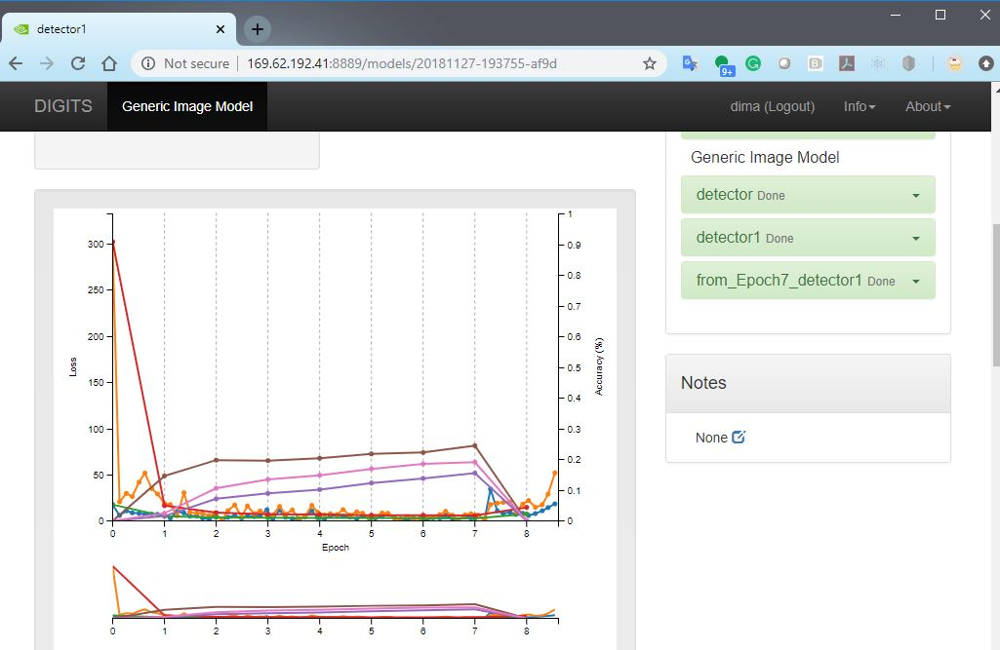

# Notes on the Kitti / object detection example
This page is attempted as a guide to accomplishing the object detection example described here in detail: https://github.com/NVIDIA/DIGITS/tree/master/examples/object-detection

We are assuming that you have a VM with Digits in it and your /data folder is passed through to your container.. 
### Pull the GoogleNet weights
```
cd /data
wget http://dl.caffe.berkeleyvision.org/bvlc_googlenet.caffemodel
```
### Clone the DIGITS 
```
cd /data
git clone https://github.com/NVIDIA/DIGITS.git
```
### Get the KITTI data
Go to the appropriate directort
```
cd /data/DIGITS/examples/object-detection
```
Now, follow the instructions here: https://github.com/NVIDIA/DIGITS/tree/master/examples/object-detection#downloading-and-preparing-the-kitti-data

Once the data is downloaded, run 
```
./prepare_kitti_data.py
```
You can now follow the rest of the guide, just remember that your datasets are located under 
```
/data/DIGITS/examples/object-detection/kitti-data
```
And your pre-trained GoogleNet weights are located under 
```
/data/bvlc_googlenet.caffemodel
```
### Notes on training
If you run the training as suggested in Nvidia github, you likely will not get to the results shown there (mAP over 50%) on the first try.  The set up does not appear to be very stable, and you are more likely to see something like this:

